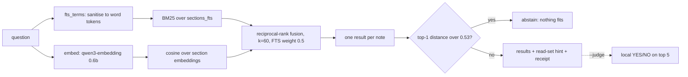
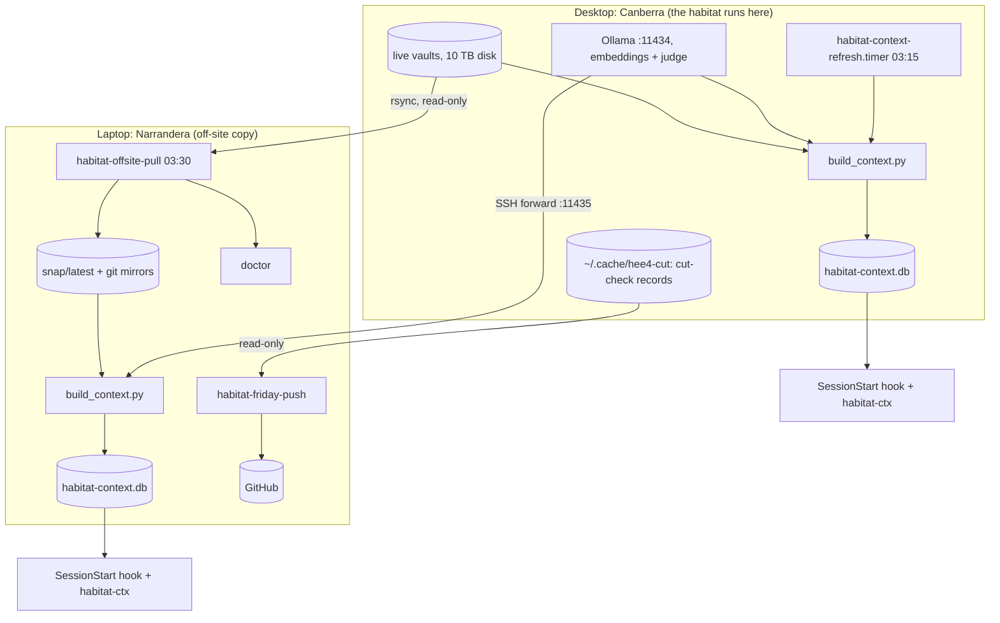

# habitat-context

**Curated, auditable context for agent sessions in the herdr habitat: one startup card, one retrieval
command, one health verdict.**

habitat-context is the tooling behind the habitat's **Quick context protocol** (ledger R-095). It
builds a Turso database from the habitat's Obsidian vaults: one row per note section, with full-text
search (BM25) and section embeddings. It answers two questions for every new Claude Code session or
context window:

1. **Where am I?** A ~2 KB startup brief: protocol, ledger counts, a live health probe and the open blockers.
2. **Where is the answer?** A hybrid search that returns the notes worth reading. It abstains when nothing fits.

Every brief and every answer writes a receipt, so what an agent was shown is auditable later.

> **Status: production, both hosts.** Index v5 is live on the laptop (Narrandera, built from the
> off-site snapshot) and on the desktop (Canberra, built from the live vaults). `tests/run_all.sh`
> passes on both hosts: 17 safety checks, the held-out regression gate and `doctor` (16 checks on the
> laptop, 14 on the desktop). Figures below were **measured** on 2026-10-07 unless marked otherwise.
>
> **As of 2026-10-07 08:30 AEDT:** public at [Louranicas/habitat-context](https://github.com/Louranicas/habitat-context)
> (branch `master`). Both hosts sit at the same commit, with clean working trees. Live blockers reported by the brief:
> 21 uncommitted HEE v4 files (awaiting `just gate commit`), and `ssh PATH shadowed` (pam_env, sudo).

The protocol itself, the rules an agent follows, lives in the vault note
`herdr.habitat.vault/00 Start/Quick context protocol.md`. This repository is the machinery.

---

## Table of contents

- [Why habitat-context](#why-habitat-context)
- [The first principle](#the-first-principle)
- [What it does](#what-it-does)
- [Install](#install)
- [Quick start](#quick-start)
- [Command reference](#command-reference)
- [Environment variables](#environment-variables)
- [Exit codes](#exit-codes)
- [Data model](#data-model)
- [How retrieval works](#how-retrieval-works)
- [Measured performance](#measured-performance)
- [Architecture](#architecture)
- [Operations: timers, refresh and the off-site copy](#operations-timers-refresh-and-the-off-site-copy)
- [Publishing to GitHub: habitat-friday-push](#publishing-to-github-habitat-friday-push)
- [Safety and security](#safety-and-security)
- [Testing and quality gates](#testing-and-quality-gates)
- [Rules learned the hard way](#rules-learned-the-hard-way)
- [Repository layout](#repository-layout)
- [Project status and limitations](#project-status-and-limitations)
- [Related habitat notes](#related-habitat-notes)

---

## Why habitat-context

The habitat holds about 26,000 note sections across 10 vaults. A session that starts cold re-derives
state it has already been told, reads the wrong notes, or trusts a stale summary. The usual remedies each
cover only part of the problem:

| Approach | What it gives | What it lacks |
| --- | --- | --- |
| `grep` over the vaults | exact, fast, trustworthy | no ranking; misses paraphrase; no "nothing matches" signal |
| a long CLAUDE.md | always loaded | stale the moment state changes; costs tokens every turn |
| Jev (typed judgment) | strong on the cleared corpus | must never see HEE v4 text (H-10a); advisory only |
| MemPalace | 284k drawers of semantic memory | drawers from earlier engine generations dominate recall; not scoped to the current habitat |
| Obsidian search | good for a human | not callable by an agent, and leaves no receipt |

habitat-context combines them. The brief is computed live, so it is never stale. Retrieval is ranked,
scoped and can abstain. Each result is tagged with Jev eligibility (`jev_ok`), so an agent knows which
hits may cross the boundary. Every call leaves a receipt.

## The first principle

> **State is a query, not a memory.** The brief is a pointer; re-check live before acting.

The brief reports only what it measured when it ran: a live probe of the desktop's Jev door, engine
HEAD and uncommitted files, lavish-guard, the SSH PATH order and failing units. A probe it cannot run is
shown as cached, with its time. Blockers are derived from that probe, never hard-coded. A failed refresh
is printed on the card (`CONTEXT REFRESH FAILED`), not hidden. A snapshot older than 26 h is flagged
`STALE`.

## What it does

1. **Startup brief.** A Claude Code `SessionStart` hook prints the card into every new session and
   context window on both hosts (about 0.7 s on the laptop).
2. **Hybrid retrieval.** Turso FTS (BM25) and cosine search over section embeddings, fused by reciprocal
   rank, one result per note. It abstains when the best vector distance exceeds 0.53.
3. **Conformal read sets.** Each answer says how many results to read for a stated hit rate: top 3 for
   ≥ 70%, top 4 for ≥ 80%, on the held-out set.
4. **Optional local judge.** `--judge` re-ranks the top 5 with a local YES/NO model, using
   log-probabilities. It is off by default and provisional.
5. **Receipts.** Each brief and ask is recorded in `receipts.db` with an `origin` tag (`session`,
   `eval`, `test`). Receipts are kept for 90 days.
6. **Labels.** `habitat-ctx label` records which note actually answered a real question, so the
   evaluation set grows from use.
7. **One health verdict.** `habitat-ctx doctor` checks the DB, versions, freshness, pins, embeddings,
   timers, hooks and MCP denies. It runs after every refresh.

## Install

Requirements (pinned; `doctor` checks each one):

| Component | Version | Location |
| --- | --- | --- |
| Turso CLI | 0.8.1 (sha256 `57f21919a4bc…`) | `~/.local/share/turso/0.8.1/tursodb` |
| pyturso | 0.8.1 | venv `~/.local/share/turso/sdk-venv` |
| Ollama, with `qwen3-embedding:0.6b` | 0.35.1 | the desktop, `127.0.0.1:11434` |
| Judge model (optional) | `gemma4:12b` | the desktop |

The repository lives at `~/.local/share/turso/context` on both hosts, with one git history synced by
bundle.

```bash
# Put the commands on PATH
ln -s ~/.local/share/turso/context/habitat-ctx                 ~/.local/bin/habitat-ctx
ln -s ~/.local/share/turso/context/bin/habitat-context-refresh ~/.local/bin/
ln -s ~/.local/share/turso/context/bin/habitat-offsite-pull    ~/.local/bin/   # laptop
ln -s ~/.local/share/turso/context/bin/habitat-friday-push     ~/.local/bin/   # laptop

# Units (laptop): symlink, reload, enable
for u in systemd/habitat-*.service systemd/habitat-*.timer; do ln -s "$PWD/$u" ~/.config/systemd/user/; done
cp -r systemd/habitat-offsite-pull.service.d ~/.config/systemd/user/
systemctl --user daemon-reload
systemctl --user enable --now habitat-offsite-pull.timer habitat-embed-tunnel.service

# Units (desktop): the nightly refresh
ln -s "$PWD"/systemd/desktop/habitat-context-refresh.{service,timer} ~/.config/systemd/user/
systemctl --user daemon-reload && systemctl --user enable --now habitat-context-refresh.timer

# First build, then check
habitat-context-refresh && habitat-ctx doctor
```

The Claude Code hook, in `~/.claude/settings.json` on both hosts:

```json
"SessionStart": [{ "hooks": [{ "type": "command", "timeout": 10,
  "command": "/home/louranicas/.local/share/turso/context/habitat-ctx brief 2>/dev/null || true" }] }]
```

## Quick start

```bash
habitat-ctx brief                                   # the startup card
habitat-ctx ask "where do facet summaries live"     # top 5, with a read-set hint
habitat-ctx ask "how is the jev door checked" --scope "70 Facets" -k 3
habitat-ctx ask "why did the curator refuse" --snippets   # excerpts: at most 8, 24 KiB in total
habitat-ctx ask "terraform state locking" --judge   # local re-rank; abstains when nothing fits
habitat-ctx label "where do facet summaries live" "herdr.habitat.vault/70 Facets/00 Facets index.md"
habitat-ctx doctor                                  # one verdict line at the end
```

Example `ask` output (measured 2026-10-07, laptop):

```
habitat-ctx ask (hybrid)  top1_dist=0.284 margin=0.005  read top 3 (>=70%) · top 4 (>=80%)
0.0236  herdr.habitat.vault/00 Start/Session state 2026-10-07.md#[note]  [fts+vec] jev_ok=0
0.0229  herdr.habitat.vault/00 Start/Session state 2026-10-06.md#[note]  [fts+vec] jev_ok=0
```

Each line gives the fused score, `vault/path#heading`, which searches found it (`fts`, `vec` or both)
and `jev_ok`. `jev_ok=1` means the section may be sent to Jev; `0` means it must not be.

Example `brief` tail (measured 2026-10-07):

```
LIVE (live 08:18): jev door ok; hee4 active at 6d02baa with 21 uncommitted files; lavish-guard PASS; ssh PATH shadowed; failing units: none.
Blockers: 21 uncommitted HEE files: the patch queue needs a desktop session (just gate commit); pam_env PATH puts /usr/bin and the mise shims before ~/.local/bin: SSH commands get the jev-axi shim and herdr 0.8.2 (sudo fix held for Luke).
```

## Command reference

### `habitat-ctx brief`

The startup card, about 2 KB. It contains:
- the protocol's short form, and where the habitat runs;
- ledger counts and the items held for Luke;
- a `LIVE` line: the Jev door, HEE HEAD and uncommitted files, lavish-guard, the SSH PATH order
  (`ssh PATH ok|shadowed|unknown`, read from `/etc/security/pam_env.conf`) and failing units;
- blockers derived from that line.

On the laptop the live probe runs over SSH (`HABITAT_HOST`). It is one read-only script on stdin, never
a nested `-c` string. When the desktop is unreachable, the brief uses the cached probe and says so.
With no DB present the brief stays silent and exits 0, so a startup hook never fails a session.

### `habitat-ctx ask "<question>" [options]`

| Option | Effect |
| --- | --- |
| `-k N` | results to return (default 5) |
| `--scope "<folder>"` | restrict to paths containing the folder, e.g. `"70 Facets"` |
| `--snippets` | a context packet: at most 8 excerpts, 24 KiB in total |
| `--judge` | local YES/NO re-rank of the top 5 (`gemma4:12b`, log-probabilities); abstains when the judge says no and the distance is > 0.40 |
| `--jev-only` | only sections cleared for Jev (`jev_ok=1`) |

On the laptop the question is embedded through the persistent forward (`127.0.0.1:11435`). If that
forward is down, `ask` opens its own short-lived `ssh -L` and closes it by its own process handle.
If embeddings are still unavailable, it falls back to FTS only and says so on the first line.

### `habitat-ctx label "<question>" "<vault/path.md>"`

Records the note that answered a real question. `tests/eval_heldout.py --with-labels` adds these
real-use labels (any origin except `eval`) to the on-topic set, and fails loudly if it cannot read them.

### `habitat-ctx stats`

Build metadata, sections and embeddings per vault, and receipts by kind.

### `habitat-ctx doctor [--full]`

One verdict over everything the protocol depends on. On the laptop it runs 16 checks (measured
2026-10-07):

```
PASS  context DB present
PASS  context DB integrity
PASS  build version agrees (code, sidecar, meta)  (5/5/5)
PASS  receipts.db integrity
PASS  d2q-cache.db integrity
PASS  last refresh PASS
PASS  last refresh under 30 h old
PASS  snapshot under 26 h old
PASS  tursodb 0.8.1 pinned binary  (57f21919a4bc)
PASS  pyturso 0.8.1
PASS  embedding endpoint  (dim=1024)
PASS  habitat-offsite-pull.timer active
PASS  habitat-embed-tunnel.service active
PASS  SessionStart brief hook
PASS  MCP write/escape tools denied
PASS  no stale partial builds
doctor verdict=PASS checks=16 fail=0 warn=0 host=laptop
```

The desktop runs 14 checks, because it has no tunnel and no off-site pull timer. `--full` adds the
held-out regression gate.

### `habitat-ctx refresh`

Starts `habitat-offsite-pull.service` on the laptop, which chains the incremental rebuild and `doctor`.

### `habitat-context-refresh`

The rebuild entry point. On the laptop it opens its own embedding tunnel to the desktop; on the desktop
it uses local Ollama. It writes `last-refresh.json`, which the brief and `doctor` read. Last line:
`context verdict=PASS|FAIL`.

### `build_context.py`

The single writer. It is incremental: a note whose sha is unchanged keeps its rows, embeddings and
generated questions. Each build is **generation-published**:
1. Build into `habitat-context.db.building`.
2. Run an integrity check, then a WAL checkpoint.
3. Move the new file into place with `os.replace`, and remove the old generation's WAL.
4. Write the build version to a `.version` sidecar, so readers never open the live file just to check it.

## Environment variables

| Variable | Default | Purpose |
| --- | --- | --- |
| `HABITAT_CTX_DB` | `~/.local/share/turso/context/habitat-context.db` | context DB (point at a copy to test) |
| `HABITAT_CTX_RECEIPTS` | `~/.local/share/turso/context/receipts.db` | receipts DB, independent of `HABITAT_CTX_DB` |
| `HABITAT_CTX_ORIGIN` | `session` | receipt and label origin tag (`eval`, `test`) |
| `HABITAT_CTX_EMB_URL` | `127.0.0.1:11435` (laptop), `:11434` (desktop), `/v1/embeddings` | embeddings endpoint |
| `HABITAT_CTX_CHAT_URL` | same host, `/v1/chat/completions` | judge endpoint |
| `HABITAT_CTX_JUDGE` | `gemma4:12b` | judge model |
| `HABITAT_CTX_ABSTAIN` | `0.53` | abstention distance (provisional, n=22) |
| `HABITAT_CTX_JUDGE_ABSTAIN` | `0.40` | judge-combined abstention distance (provisional) |
| `HABITAT_CTX_FTS_W` | `0.5` | FTS weight in the fusion |
| `HABITAT_CTX_NO_TUNNEL` | unset | never open an SSH forward |
| `HABITAT_HOST` | `desktop-native-tail` | SSH host for probes, pulls and cut records |
| `HABITAT_SNAP` | live vaults (desktop), `snap/latest/vaults` (laptop) | build source |
| `HABITAT_EMBED_ALL` | unset | experiment: embed every vault |
| `HABITAT_OFFSITE` | `~/Backups/herdr-habitat-offsite` | off-site root |
| `HABITAT_PUSH_DRYRUN` | `0` | `1` = every push check plus `git push --dry-run`; nothing is published |
| `HABITAT_PUSH_SKIP_PULL` | `0` | `1` = use the mirrors as they are (testing only) |

## Exit codes

| Command | 0 | 1 | 2 |
| --- | --- | --- | --- |
| `habitat-ctx brief` | always (a startup hook must never fail a session) | – | – |
| `habitat-ctx ask / stats / label` | success | no context DB, or an error | usage |
| `habitat-ctx doctor` | every check passed | one or more checks failed | – |
| `habitat-ctx refresh` | the pull service succeeded | it failed | – |
| `habitat-context-refresh` | `context verdict=PASS` | `FAIL` | – |
| `habitat-offsite-pull` | `offsite verdict=PASS` | `FAIL` (`latest` unchanged) | – |
| `habitat-friday-push` | `push verdict=PASS` | `FAIL` (per-repo reason in the log) | – |
| `tests/run_all.sh` | `run_all verdict=PASS` | `FAIL` | cannot find the repo |

Every script ends with one verdict line. Diagnostics go to stderr.

## Data model

`habitat-context.db` (Turso 0.8.1; FTS needs `experimental_features="index_method"`):

| Table | Columns | Role |
| --- | --- | --- |
| `sections` | `id, vault, path, heading, body, sha, jev_ok, emb, ctx` | one row per note section, plus one note card per note (`#[note]`) and generated-question rows (`#[q] …`). `ctx` is `vault > title / heading` |
| `notes` | `path, vault, sha, mtime` | change detection for incremental builds |
| `meta` | `key, value` | provenance: `built_at`, `snapshot`, `emb_model`, `tursodb`, `build_version`, `fts_cols` |
| `sections_fts` | FTS index on `sections(body)` | BM25 |

The other databases:

| Database | Contents | Notes |
| --- | --- | --- |
| `receipts.db` | `prime_receipts` (what each brief and ask showed), `cache` (the last live probe), `labels` | receipts kept 90 days |
| `d2q-cache.db` | `d2q(path, sha, questions)` | doc2query questions cached by note sha, pruned to live notes |

Embedded today: 7,482 of 26,309 sections, from six vaults:
- herdr.habitat (including the 26 facet notes);
- HEE v4;
- Jev;
- Turso;
- toolshed;
- orchestration.

Fedora, diary, pi and agentic-coding-school are FTS only. **Only the current engine generation (HEE v4) is indexed; earlier engine vaults are out of scope (V4-9).**

## How retrieval works



Three details matter:
- **`fts_score` needs a literal and a bare WHERE.** Bound parameters return 0.0 for every row, so query
  terms are sanitised to `[A-Za-z0-9_-]` words before they are inlined. The safety tests prove the
  sanitiser is load-bearing.
- **Contextual embeddings.** Each section is embedded with its `ctx` (vault, note title and heading), so a
  short section still carries its context.
- **doc2query rows.** For each note, a local model writes the questions the note answers. They are
  indexed as `#[q]` rows and cached by sha in `d2q-cache.db`.

## Measured performance

On the independent held-out set: 40 on-topic questions written by an agent with no retrieval access,
plus 8 off-topic. Measured 2026-10-07 on the laptop, index v5.

| Measure | Result |
| --- | --- |
| Hybrid hit@1 / @3 / @5 / @10 | 19 / 30 / 35 / 36 of 40 |
| Never retrieved | 4 |
| Off-topic abstained | 7 / 8 (the near-miss Terraform question is not) |
| FTS-only fallback, @1 / @5 | 15 / 30 |
| Mean `ask` latency in the eval | 0.26 s (laptop, persistent forward); about 0.12 s on the desktop |
| Startup brief | about 0.7 s (laptop, live probe over SSH) |
| `--judge` latency | about 3.6 s (laptop); about 1.3 s warm on the desktop |
| Read-set guarantee (conformal) | top 3 ≥ 70%, top 4 ≥ 80% |

By question type:

| Type | n | hit@1 | hit@5 |
| --- | --- | --- | --- |
| deep | 14 | 10 | 14 |
| symptom | 12 | 8 | 12 |
| why | 11 | 6 | 10 |
| how | 7 | 3 | 6 |
| vague | 6 | 1 | 4 |
| where | 4 | 1 | 3 |
| shallow | 26 | 9 | 21 |

A question can carry more than one type, so n sums to more than 40.

**How much to trust build 5 over build 3.** A paired bootstrap at n=40 on a deterministic harness gives:

| Measure | build 5 − build 3 | 95% CI |
| --- | --- | --- |
| @1 | −1 | [−5, +2] |
| @3 | +2 | [0, +5] |
| @5 | +2 | [−2, +6] |

The @3 gain is plausible. The @5 gain is not established. Grow the set with `habitat-ctx label` before
tuning further.

**Negative results (measured, kept so nobody repeats them):**
- HyDE: @1 fell from 20 to 17.
- A `(ctx, body)` FTS index: @5 fell from 30 to 21–25.
- FTS weight tuning: within noise.
- v4 cards alone, and Turso doc2query (v6): no gain.
- Full-corpus embeddings: not measurable on this set.

## Architecture



Design rules:
- **Single writer per database.** Only `build_context.py` writes the context DB, and only to an
  unpublished copy.
- **Read-only toward the desktop.** The laptop uses git upload-pack, the rsync sender,
  `sqlite3 -readonly .dump` and Ollama compute. It never writes to the desktop.
- **Host-aware, one codebase.** Both machines are named `omarchy`. The desktop is recognised by its
  10 TB vault root.
- **Advisory, not authoritative.** HEE's `decide` remains the single verdict authority. Jev stays
  advisory, and HEE v4 text never goes to Jev (H-10a). `jev_ok` makes that boundary visible on every
  result.

## Operations: timers, refresh and the off-site copy

| Unit | Host | When | What |
| --- | --- | --- | --- |
| `habitat-offsite-pull.timer` | laptop | daily 03:30 | git mirrors, a hard-linked dated snapshot (30 days), SQL dumps of the live DBs and restore checks; then the context rebuild and `doctor` (drop-in `10-context-refresh.conf`) |
| `habitat-embed-tunnel.service` | laptop | always | persistent SSH forward `11435 → desktop:11434`; seccomp-only hardening |
| `habitat-context-refresh.timer` | desktop | daily 03:15 | rebuild from the live vaults |
| `habitat-friday-push.timer` | laptop | one-off, Fri 2026-10-09 09:17 | the guarded GitHub push (next section) |

What the off-site pull copies:
- **Git mirrors:** `hee4`, `loom-lattice-habitat`, `deep-diff-forge` and `firstmate`.
- **Files:**
  - HEE evidence, without its DBs;
  - handoffs;
  - every current vault (earlier engine vaults are out of scope), excluding plugin `data.json`, `.trash` and `*.bak-*`;
  - the pstack checkout;
  - Firstmate data;
  - the latest engine and habitat backups.
- **Database dumps:** `hee4-ops`, `firstmate` and `habitat-ops`.

`snap/latest` moves only when every step has passed. Each run restores every mirror and every dump into
a temporary directory and checks its integrity.

## Publishing to GitHub: habitat-friday-push

The laptop holds the GitHub credential; the desktop holds none, by design. `habitat-friday-push` first
refreshes the mirrors, then pushes each repository only if every guard passes:

| Guard | Refuses when |
| --- | --- |
| fast-forward | GitHub's tip is not an ancestor of ours (no force, ever) |
| authors | a commit to be published has a placeholder author (`example.com`) |
| secrets | an added line matches a token or private-key pattern |
| HEE cut | (HEE only) the commit has no PASS `cut-check.json`. HEE publishes its newest cut-checked commit, never an unchecked HEAD |
| dry run | `git push --dry-run` fails |
| verify | after the push, GitHub's tip must equal ours |

It pushes branches only. Tags are a release decision (`just cut-check`) and are never pushed here.
It covers HEE v4, LoomLattice, deep-diff-forge and this repository (pushed from the laptop's working copy).
Upstream checkouts (Firstmate, cursor-plugins) are never pushed.

```bash
HABITAT_PUSH_DRYRUN=1 habitat-friday-push                  # preview: every check, nothing published
systemctl --user list-timers habitat-friday-push.timer
systemctl --user disable --now habitat-friday-push.timer   # cancel
```

Controls planted on 2026-10-07: a placeholder author, a token-like line and a diverged history. Each
was refused, and a missing cut record also refused HEE. The first real run, on 2026-10-07, passed and
published:
- HEE `a6355ef..3293599` (396 commits);
- LoomLattice (1 commit);
- deep-diff-forge (3 commits);
- this repository, first published the same morning (`714ff8f`, then `088cebe`).

## Safety and security

- **No write path through retrieval.** Query terms are sanitised before they reach an FTS literal.
  `tests/test_safety.py` fires injection attempts through `ask()` and proves that the DB's schema hash and
  row counts are unchanged. A planted control shows an unsanitised quote really does break the query.
- **MCP escape denied.** The Turso MCP's `open_database` ignores `--readonly`. It is denied in
  `~/.claude/settings.json`, together with every write tool (`insert_data`, `update_data`,
  `delete_data`, `schema_change`). `doctor` checks that the denies are present.
- **Jev boundary.** `jev_ok` is computed by the desktop's `jev-boundary` (exit 3 = refuse). HEE v4
  vault sections are always `jev_ok=0`.
- **No secrets in the snapshot.** Plugin `data.json` files are excluded from the pull.
- **systemd hardening.** The SSH units use seccomp and no-new-privileges only. Namespace options
  (`ProtectSystem`, `PrivateTmp`) make OpenSSH reject root-owned configs in a user unit.

## Testing and quality gates

```bash
tests/run_all.sh
# = tests/test_safety.py    17 checks: sanitiser, injection, planted control
#   tests/eval_heldout.py   regression gate: hit@1 >= 17, hit@5 >= 33 (ratcheted)
#   habitat-ctx doctor      host health
```

`run_all` uses throwaway receipts (`HABITAT_CTX_RECEIPTS` under `/tmp`, origin `eval`), so test traffic
never pollutes real receipts. Every test must be able to fail: each gate has a planted control showing
that it catches what it claims.

To test a build, point `HABITAT_CTX_DB` at a copy:

```bash
HABITAT_CTX_DB=/tmp/copy.db tests/eval_heldout.py --min-hit1 17 --min-hit5 33 --json out.json
tests/eval_heldout.py --fts-only          # the degraded path
tests/eval_heldout.py --with-labels       # include labels gathered from real use
```

## Rules learned the hard way

From 2026-10-06 and 2026-10-07. Each one cost a real failure.

- **Never move a DB without its `-wal`.** A stray WAL replayed over a moved database and erased its
  schema. Test missing files with `HABITAT_CTX_DB`, not `mv`.
- **pyturso 0.8.1 locks a DB file per process, even for reads.** Never hold a connection while calling
  `habitat-ctx`; it retries for about 3 s. `tursodb --readonly --mcp` does not take the lock.
- **Remove the old generation's WAL at publish**, or it replays over the new file.
- **`fts_score` needs a literal and a bare WHERE.** Otherwise it returns 0.0 for every row.
- **Ollama `/v1` silently truncates prompts at about 2k tokens.** Set `num_ctx` on the native API when
  it matters.
- **Never kill by a pattern that matches your own command line** (`pkill -f`). Kill by exact PID and
  exclude `$$`.
- **Remote commands go in quoted `bash -s` heredocs**, never nested `bash -c`. A `->` in an echo label
  once overwrote the Jev door.
- **Measure on the independent set.** A self-written set scored 14/14; the honest figure was 15/40.
- **Non-interactive SSH never reads `~/.bashrc` on Arch.** PATH for SSH commands comes from
  `/etc/security/pam_env.conf`, which is why the brief reports `ssh PATH`.

## Repository layout

| Path | Role |
| --- | --- |
| `habitat-ctx` | the CLI: brief, ask, label, stats, doctor, refresh |
| `build_context.py` | the incremental, generation-published builder (index v5) |
| `bin/habitat-context-refresh` | rebuild entry point; writes `last-refresh.json` |
| `bin/habitat-offsite-pull` | laptop: off-site mirrors, snapshots, dumps and restore checks (R-060) |
| `bin/habitat-friday-push` | laptop: the guarded GitHub push |
| `systemd/` | laptop units: the pull timer and its refresh drop-in, the embedding tunnel, the push timer |
| `systemd/desktop/` | desktop units: the nightly refresh |
| `tests/` | `run_all.sh`, `test_safety.py`, `eval_heldout.py`, `heldout.json` |
| `ops/external-changes/` | patch records for edits made outside any repository, with reasons and backup names |

Not in git (`.gitignore`): the databases and their WAL files, `last-refresh.json`, the `.version`
sidecar and the generated `elig_check.py`.

## Project status and limitations

In production on both hosts. Current limitations:
- **Abstention thresholds are provisional.** 0.53 was set on n=22. The judge-combined 0.40 is too
  aggressive: used alone it abstained wrongly on 10 of 40. More labels are needed.
- **The @5 gain over build 3 is not established** at n=40 (see the bootstrap above).
- **Vague and "where" questions are the weakest:** hit@1 is 1/6 and 1/4.
- **Four vaults are FTS only:** Fedora, diary, pi and agentic-coding-school are not embedded.
- **SSH PATH.** Until `/etc/security/pam_env.conf` puts `~/.local/bin` first (a sudo change held for
  Luke), SSH commands get the `jev-axi` shim and herdr 0.8.2. The brief reports this as a blocker.

## Related habitat notes

- Protocol: `herdr.habitat.vault/00 Start/Quick context protocol.md`
- Session state: `herdr.habitat.vault/00 Start/Session state 2026-10-07.md`
- Ledger: `herdr.habitat.vault/50 Ledger/Recommendations ledger.md` (R-060, R-095)
- Facets: `herdr.habitat.vault/70 Facets/16 Turso and the agent knowledge system.md` and
  `21 Backups mirrors and recovery.md`
- Turso SDK and MCP: `turso.vault` (desktop) and `Omarchy.vault/Reference/Turso SDK and MCP.md` (laptop)

---

- **GitHub (public):** https://github.com/Louranicas/habitat-context
- **Working copies:** `~/.local/share/turso/context` on both hosts, one history synced by git bundle. The laptop publishes it with `habitat-friday-push`.
